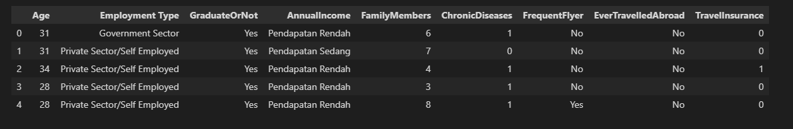

# Laporan Proyek Machine Learning
### Nama : Arul Insan
### Nim : 211351028
### Kelas : IF Pagi B

## Domain Proyek
Proyek ini bertujuan untuk mengembangkan sistem prediksi yang dapat memprediksi pembelian asuransi perjalanan oleh calon pelanggan. Dengan menggunakan teknik analisis data dan machine learning, proyek ini akan memanfaatkan data historis dan variabel-variabel terkait untuk membangun model prediktif yang akurat. Sehingga bisa tahu calon pelanggan ini akan membeli atau tidak.

## Business Understanding 
Dalam konteks asuransi perjalanan, pemahaman bisnis fokus pada identifikasi faktor-faktor yang mendorong keputusan pembelian asuransi oleh calon pelanggan. Data historis dan tren pembelian dapat memberikan wawasan mendalam tentang perilaku pelanggan dan mengapa mereka cenderung memilih produk asuransi perjalanan. Beberapa faktor yang mungkin memengaruhi keputusan pembelian ini melibatkan Umur, Tipe Ketenagaan Kerja, Pendapatan tahunan, banyaknya Keluarga, dan riwayat penyakit. Selain itu, faktor-faktor seperti riwayat perjalanan, destinasi yang sering dikunjungi, sebelumnya dapat menjadi pertimbangan penting dalam memprediksi perilaku pembelian asuransi perjalanan. Dengan pemahaman mendalam ini, proyek ini bertujuan untuk membangun model prediktif yang dapat secara akurat mengidentifikasi calon pelanggan yang cenderung membeli asuransi perjalanan, sehingga memungkinkan perusahaan untuk mengarahkan upaya pemasaran dan penjualan mereka dengan lebih efektif.

### Problem Statements
Latar belakang masalah:

- Perusahaan sulit untuk memprediksi apakah calon pelanggan akan membeli paket asuransi perjalanan atau tidak

- Perusahaan tidak dapat membuat sebuah strategi baru dalam penjualan paket asuransi perjalanannya

### Goals

Tujuan dari pernyataan masalah :
- Membuat penelitian memprediksi apakah calon pelanggan akan membeli paket asuransi perjalanan atau tidak 

- Perusahaan dapat mengetahui calon pelanggan akan membeli paket asuransi atau tidak.

## Data Understanding

Dataset di ambil dari kaggle :

####[*Travel Insurance Prediction Data*](https://www.kaggle.com/datasets/tejashvi14/travel-insurance-prediction-data/data)

#### Mengimport dataset dari kaggle :

``` Python
from google.colab import files
files.upload()
```

``` Python
!mkdir -p ~/.kaggle
!cp kaggle.json ~/.kaggle/
!chmod 600 ~/.kaggle/kaggle.json
!ls ~/.kaggle
```

Mendownload dataset

``` Python
!kaggle datasets download -d tejashvi14/travel-insurance-prediction-data
```

Mengekstrak dataset

``` Python
!mkdir travel-insurance-prediction-data
!unzip travel-insurance-prediction-data.zip -d travel-insurance-prediction-data
!ls travel-insurance-prediction-data
```

### Mengimport library

``` Python
import matplotlib.pyplot as plt
import pandas as pd
import numpy as np
import seaborn as sns
import plotly.express as px
from sklearn.model_selection import train_test_split
from sklearn.metrics import accuracy_score, confusion_matrix, classification_report
from sklearn.tree import DecisionTreeClassifier
from sklearn import tree
from sklearn.tree import plot_tree
```

### Data Discovery
Membaca data csv
``` Python
df = pd.read_csv ("travel-insurance-prediction-data/TravelInsurancePrediction.csv")
```

Melihat Type data pada setiap kolom
``` Python
df.info() 
```


Melihat isi pada data

``` Python
df.head()
```


Melihat apakah data ada yang null(Kosong) atau tidak setiap kolom
``` Python
df.isnull().sum() 
```


Melihat statistik data
``` Python
df.describe() 
```


### Variabel-variabel pada Travel Insurance Prediction Data adalah sebagai berikut:
- Unamed 0 : merupakan index setiap data  (Dtype : Int64)
- Age : Merupakan Umur Pelanggan Travel (Dtype : Int64) [Contoh : 32, 33, 34,dll]

- Employment Type : Merupakan Ketenagaan kerja yang pilih dalam pembelian (Dtype : Object) [Contoh : Government Sector,Private Sector/Self Employed\]
- GraduateOrNot : Adalah Pilihan apakah pelanggan sudah lulus kuliah atau belum(Dtype : object) [Contoh : Yes, No]
- AnnualIncome  : Adalah Pendapatan Tahunan dari paket Asuransi (Dtype : Int64)
- FamilyMembers  : Merupakan Berapa Jumlah keluarga pelanggan (Dtype : Int64)[Contoh : 1, 2 3,dll]
- ChronicDiseases: Merupakan apakah pelanggan memiliki penyakit khusus atau tidak (Dtype : Int64)[Contoh : Yes, No]
- FrequentFlyer : Yaitu Apakah Pelanggan Sudah sering melakukan penerbangan? (Dtype : Object) [Contoh : Yes, No]
- EverTravelledAbroad : Yaitu Apakah Pelanggan Pernah Bepergian ke Luar Negeri? (Dtype : Object) [Contoh : Yes, No]
- TravelInsurance : Yaitu Apakah Pelanggan tersebut Membeli asuransi perjalanan atau tidak(Dtype :  int64) [Contoh : Yes, No]

### EDA

Melihat Persentase Pelanggan yang Membeli Asuransi Perjalanan dan tidak membeli.
``` Python
fig, ax1 = plt.subplots(nrows=1, sharey=False, figsize=(14,6))

#Pie Plot
ax1 = df['TravelInsurance'].value_counts().plot.pie( x ="Tidak Membeli" ,y ='Membeli',
                   autopct = "%1.0f%%",labels=["Tidak Membeli","Membeli"], startangle = 30,ax=ax1)
ax1.set(title = "Persentase Pelanggan Membeli Asuransi Perjalanan Atau Tidak ")
```


Melihat Analisis Faktor banyaknya pembelian asuransi perjalanan berdasarkan : Usia.

``` Python
df=df
figure=px.histogram(df, x="Age", color= "TravelInsurance", title= "Analisis Faktor banyaknya pembelian asuransi perjalanan berdasarkan : Usia")
figure.update_layout(
    autosize=False,
    width=1200,
    height=900 
)
figure.show()
```


Melihat Analisis Faktor banyaknya pembelian asuransi perjalanan berdasarkan : Tipe Ketenagakerjaan.

``` Python
df=df
figure=px.histogram(df, x="Employment Type", color= "TravelInsurance", title= "Analisis Faktor banyaknya pembelian asuransi perjalanan berdasarkan : Tipe Ketenagakerjaan")
figure.update_layout(
    autosize=False,
    width=900,
    height=900
)
figure.show()
```


Melihat Analisis Faktor banyaknya pembelian asuransi perjalanan berdasarkan : Pendapatan tahunan.

``` Python
df=df
figure=px.histogram(df, x="AnnualIncome", color= "TravelInsurance", title= "Analisis Faktor banyaknya pembelian asuransi perjalanan berdasarkan : Pendapatan tahunan")
figure.show()
```


Melihat Analisis Faktor banyaknya pembelian asuransi perjalanan berdasarkan : Asuransi Perjalanan.

``` Python
df=df
figure=px.histogram(df, x="Employment Type", color= "TravelInsurance", title= "Analisis Faktor banyaknya pembelian asuransi perjalanan berdasarkan : Asuransi Perjalanan")
figure.update_layout(
    autosize=False,
    width=900,
    height=900
)
figure.show()
```


### Data Preprocessing

Sebelum data di modeling kita lakukan proses data agar data tersebut lebih matang untuk di pakai.

kita hapus kolom yang tidak di perlukan, yaitu kolom index "Unamed: 0".

``` Python
df.drop(columns = ['Unnamed: 0'], inplace = True)
```

lalu lakukan pengkategorian kolom dan di buat menjadi satu variable dari semua kolom kecuali kolom TravelInsurance yang akan di jadikan label.

``` Python
ind_col = [col for col in df.columns if col != 'TravelInsurance']
```

Melakukan pengkategorian pada kolom AnnualIncome, dimulai dengan mengambil nilai minimal dan nilai maximal lalu di bagi 4 elemen agar bisa dibagi menjadi 3 kategori

``` Python
bins = np.linspace(min(df["AnnualIncome"]), max(df["AnnualIncome"]), 4)
```

Melihat hasil pembagian antara batas minimal, tengah, dan maksimal
``` Python
print(bins)
```


Membuat Kategorinya

``` Python
kategori = ['Pendapatan Rendah', 'Pendapatan Sedang', 'Pendapatan Tinggi']
```

Lalu masukan pada kolom
``` Python
df["AnnualIncome"] = pd.cut(df["AnnualIncome"], bins, labels= kategori, include_lowest= True)
```

lalu lakukan pengecekan pada datanya
``` Python
df.head()
```



Ubah isi AnnualIncome yang sudah di ubah itu menjadi integer lagi
``` Python
df["AnnualIncome"].replace(['Biaya Rendah','Biaya Sedang', 'Biaya Tinggi'],[1,2,3],inplace=True)
df["AnnualIncome"] = df["AnnualIncome"].astype('int64')
```

Lalu sisanya ubah beberapa kolom menjadi integer

``` Python
df.replace({'Employment Type' : {"Government Sector" : 1}}, inplace = True)
df.replace({'Employment Type' : {"Private Sector/Self Employed" : 0}}, inplace = True)

df.replace({'GraduateOrNot' : {"Yes" : 1}}, inplace = True)
df.replace({'GraduateOrNot' : {"No" : 0}}, inplace = True)

df.replace({'FrequentFlyer' : {"Yes" : 1}}, inplace = True)
df.replace({'FrequentFlyer' : {"No" : 0}}, inplace = True)

df.replace({'EverTravelledAbroad' : {"Yes" : 1}}, inplace = True)
df.replace({'EverTravelledAbroad' : {"No" : 0}}, inplace = True)
```

### Modeling

Lakukan Train Testing data dengan test size nya 20% dan random state yang di ambil adalah 40

``` Python
x = df.drop(columns=['TravelInsurance'],axis=1)
y = df['TravelInsurance']
x_train, x_test, y_train, y_test = train_test_split(x,y,test_size=0.2, random_state=40)
print(f"'X' shape: {x_train.shape}")
print(f"'y' shape: {y_test.shape}")
```

``` Python
dtc = DecisionTreeClassifier(
    ccp_alpha=0.0, class_weight=None, criterion='entropy',
    max_depth=4, max_features=None, max_leaf_nodes= None,
    min_impurity_decrease= 0.0, min_samples_leaf= 1,
    min_samples_split= 2, min_weight_fraction_leaf= 0.0,
    random_state= 42, splitter= 'best'
)


model = dtc.fit(x_train,y_train)
dtc_acc = accuracy_score(y_test, dtc.predict(x_test))

print(f"Akurasi Data Training = {accuracy_score(y_train, dtc.predict(x_train))}")
print(f"Akurasi Data Testing = {dtc_acc} \n")

print(f"Confusion Matrix : \n{confusion_matrix(y_test, dtc.predict(x_test))}\n")
confusion = confusion_matrix(y_test, dtc.predict(x_test))
tn, fp, fn, tp= confusion.ravel()
print(f"Classification Report : \n {classification_report(y_test, dtc.predict(x_test))}")
```


Maka Hasil yang di keluarkan adalah akurasi yang di harapkan yaitu > 0.70 atau 70% yang dimana akurasi pada dataset ini sangat baik untuk lakukan prediksi

### Visualisasi hasil algoritma
Melihat visualisasi pohon keputusannya

``` Python

fig = plt.figure(figsize= (45,20))
_ = tree.plot_tree(model, feature_names= ind_col,
                   class_names = ['No','Yes'],
                   filled = True,fontsize=16)
```


### Save Model (CSV)

Lakukan save model ke CSV setelah data di processing

``` Python
df.to_csv('DTree_TravelInsurance.csv',index=False)
```

### Deployment

####[*-STREAMLIT LINK SIMULASI-*](https://www.kaggle.com/datasets/tejashvi14/travel-insurance-prediction-data/data)


